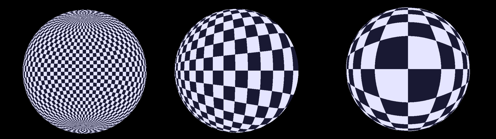

# Priartinimas ant sferos paviršiaus

## Komanda

- Arnas Vaicekauskas
- Domantas Keturakis

## Tikslas

Padaryti priartinimą tam tikroje sferos vietoje.

## Naudotos technologijos

Pasiteklta WebGL technologija su Three.js biblioteka. Kodas buvo rašomas JavaScript kalba.

## Sprendimas

Priartinimas prie polio yra įvykdomas ganėtinai paprastai. Užtenka tik vienos kodo eilutės:

```glsl
vec2 zoom(vec2 uv) {
    return vec2(uv.x, pow(uv.y, u_zoom));
}
```

Tačiau galėti daryti priartinimą prie vieno polio nėra ypatingai idomu todėl papildomai sudarėme galimybe pakeisti sferos polių poziciją. Tai padarėme pirmiausiai transformuodami $uv$ koordinates į sferines $(\phi, \theta)$ (čia pagal nutylėjimą $r=1$)

```glsl
float phi = 2.0 * PI * uv.x;
float theta = PI * (1.0 - uv.y);
```

Šios paverčiamos iš sprefinės koordinačių sistemo į Dekarto koordinačių sistemą, nusakoma vektoriu $(x, y, z)$.

```glsl
vec3 pos = sphericalToCartesian(phi, theta);
```

Turiant `pos` ir `pole` koordinates, jas visas pasukame:

```glsl
vec3 newPoleCartesian = sphericalToCartesian(pole.x, pole.y);
mat3 rotationMatrix = getRotationMatrix(newPoleCartesian);
vec3 rotatedPos = rotationMatrix * pos;
```

Paskutiniuse žingsniuose jos paverčiamos atgal į sferinę koordinačių sistemą:

```glsl
vec2 rotatedSpherical = cartesianToSpherical(rotatedPos);
```


o vėliau normalizuojamos į $uv$.

```glsl
vec2 newUv;
newUv.x = (rotatedSpherical.x / (2.0 * PI)) + 0.5; // Normalize longitude
newUv.y = 1.0 - rotatedSpherical.y / PI; // Normalize latitude
}
```

Paskutiniame žingsnyje, pagal naujas `uv` koordinates `newUv` yra sugeneruojama procedūrinė šachmatų lentos tekstūra:

```glsl
vec3 color1 = vec3(.9, .9, 1.0);
vec3 color2 = vec3(.1, .1, .2);
float scale = 32.0;
vec2 scaledUV = newUv * scale;

scaledUV.x = 2.0 * scaledUV.x;

// Determine the row and column indices
int checkerX = int(floor(scaledUV.x));
int checkerY = int(floor(scaledUV.y));

// Compute the checkerboard pattern using the parity of the indices
bool isEven = (checkerX + checkerY) % 2 == 0;

// Select the color based on the checkerboard pattern
vec3 color = isEven ? color1 : color2;

// Set the fragment color
FragColor = vec4(color, 1.0);
```

## Rezultatai

Programos rezultatai



Programa yra interaktyvi:
- Sferos polius galima judinti su klaviatūros mygtukais `a`, `w`, `s`, `d`
- Sferą sukinėti galima su rodyklių mygutkais
- Priartinimo stiprumą galima reguliuoti su pelytės viduriniu mygtuku

## Komentarai

linijos priartintoje sferos vietoje turėtų būtų elipsė.
